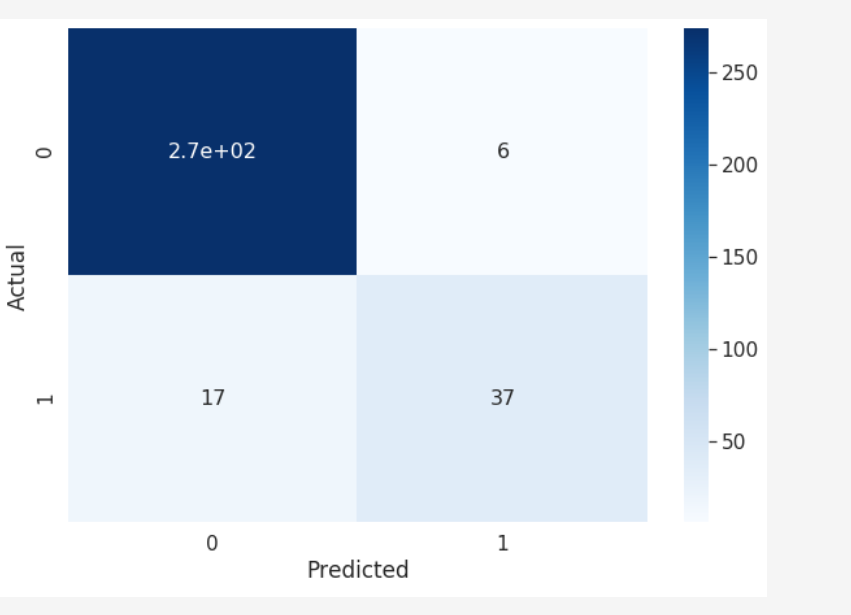
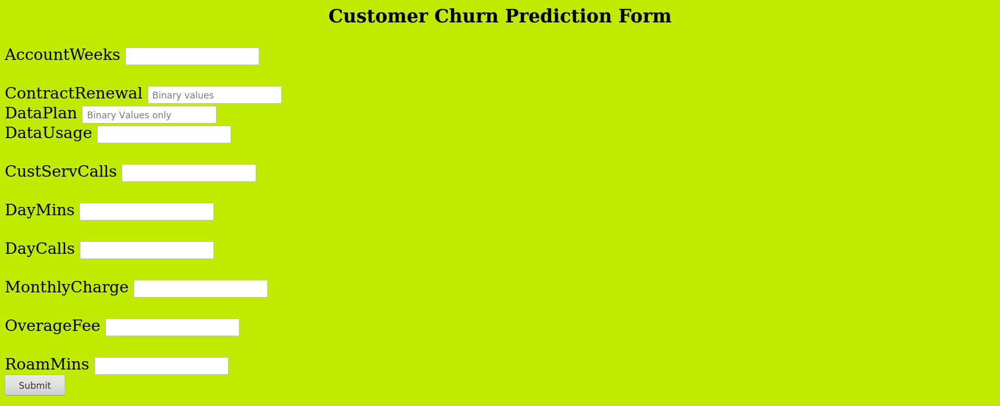

# Cchurn
A Machine Learning based web app to predict customer churn in context to telecom industry 

**What is Customer Churn?**

Customer churn (also known as customer attrition) refers to when a customer (player, subscriber, user, etc.) ceases his or her relationship with a company. Online businesses typically treat a customer as churned once a particular amount of time has elapsed since the customer’s last interaction with the site or service. The full cost of churn includes both lost revenue and the marketing costs involved with replacing those customers with new ones. Reducing churn is a key business goal of every online business.

**The ML Model**

The underlying machine learning model is a Multi Layer Perceptron classifier . It acheived 97 % accuarcy on test dataset . 

Features that have been taken to consideration to make the prediction

-AccountWeeks

-ContractRenewal

-DataPlan

-DataUsage

-CustServCalls

-DayMins

-DayCalls

-MonthlyCharge

-OverageFee

-RoamMins

The web app takes input those fields by corresponding forms .

**Confusion matrix of the machine learning model**

**Screenshot of the web app**

